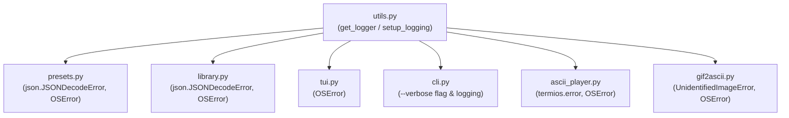

# Spec: Replace Silent 'except Exception' with Specific Exception Handling and Centralized Logging

**Date:** 2026-08-14  
**Topic:** Core Error Handling & Diagnostics  
**Related Issue:** [#9 (quality(core): Replace silent 'except Exception' with specific exception handling and logging)](https://github.com/TIXIANO70/gif2ascii/issues/9)  
**Status:** Approved  

---

## 1. Overview & Problem Statement
In multiple modules (`library.py`, `presets.py`, `tui.py`, `cli.py`, `ascii_player.py`, `gif2ascii.py`), generic `except Exception:` blocks silently swallow exceptions with `pass` or return empty fallback data without logging diagnostic messages.

This causes issues such as:
- Corrupt JSON files (`library.json`, `presets.json`) being quietly ignored and potentially overwritten, causing permanent data loss.
- Filesystem and permission errors (`OSError`) failing without explanation.
- Difficulty diagnosing runtime issues during automated usage or CLI playback.

---

## 2. Architecture & Components

### 2.1 Centralized Logging (`utils.py`)
- Define `get_logger() -> logging.Logger` returning a logger named `"gif2ascii"`.
- Define `setup_logging(verbose: bool = False)`:
  - Formats output as `"[gif2ascii %(levelname)s] %(message)s"`.
  - Attaches `StreamHandler(sys.stderr)` to avoid interfering with stdout ANSI frame streams.
  - Sets level to `logging.DEBUG` when `verbose=True`, and `logging.WARNING` by default.

### 2.2 Specific Exception Handling by Module

#### `presets.py`
- `load_user_presets()`:
  - Catch `(json.JSONDecodeError, OSError) as e:`.
  - Log `logger.warning(f"Failed to load user presets from '{self.config_file}': {e}")`.
  - Return `{}`.
- `save_user_presets()`:
  - Catch `OSError as e:`.
  - Log `logger.warning(f"Failed to save user presets to '{self.config_file}': {e}")`.

#### `library.py`
- `load_index()`:
  - Catch `(json.JSONDecodeError, OSError) as e:`.
  - Log `logger.warning(f"Failed to load library index from '{self.index_file}': {e}")`.
  - Return `{"favorites": {}, "history": []}`.
- `save_index()`:
  - Catch `OSError as e:`.
  - Log `logger.warning(f"Failed to save library index to '{self.index_file}': {e}")`.
- `remove_favorite()`:
  - Catch `OSError as e:` when deleting file and log warning.
- `add_to_history()`:
  - Catch `OSError as e:` when copying/pruning cached asciigif files and log warning.
- `os.get_terminal_size()`:
  - Catch `OSError:`.

#### `tui.py`
- `get_gif_files()`:
  - Catch `OSError as e:` and log `logger.warning(f"Failed to scan directory for GIF files: {e}")`.
- `os.get_terminal_size()`:
  - Catch `OSError:`.

#### `cli.py`
- Support global `-v / --verbose` flag in argument parser.
- Call `setup_logging(verbose=args.verbose)`.
- Replace `except Exception:` on terminal size calls with `except OSError:`.
- In `uninstall`, catch `(subprocess.SubprocessError, OSError) as e:`.

#### `ascii_player.py`
- In raw mode setup/teardown: catch `(termios.error, OSError) as e:` and log `logger.debug(...)`.
- In package loading: catch `(gzip.BadGzipFile, json.JSONDecodeError, OSError, UnicodeDecodeError) as e:` and log error before exit.

#### `gif2ascii.py`
- In frame extraction tile composition: catch `(IndexError, ValueError, OSError, AttributeError) as e:` and log `logger.debug(...)`.
- In image open: catch `(PIL.UnidentifiedImageError, OSError) as e:`.

---

## 3. Verification & Testing

### 3.1 Automated Tests (`tests/test_error_handling.py`)
- Test loading corrupted `presets.json` raises `JSONDecodeError` internally, emits logger warning, and safely returns empty dict.
- Test loading corrupted `library.json` emits logger warning and safely returns default index structure.
- Test `remove_favorite` handles `OSError` without crash.
- Test `setup_logging(verbose=True)` and `setup_logging(verbose=False)`.

### 3.2 Manual Tests
- Run `python3 -m unittest discover -s tests -p "test_*.py"`.
- Run `python3 cli.py -v preset list`.
